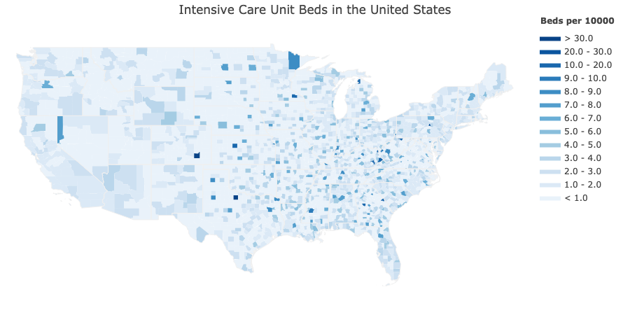

# County-level Socioeconomic Data for Predictive Modeling of Epidemiological Effects



**TL/DR:** We gather a *machine readable* dataset related to socioeconomic factors that may affect the spread and/or consequences of epidemiological outbreaks, particularly the novel coronavirus (COVID-19). This dataset is envisioned to serve the data science, machine learning, and epidemiological modeling communities. If you want to contribute, please let us know!

**Overview:** Despite overoptimistic promises of an “American Resurrection” by Easter Sunday, many scientists and citizens fear that current mitigation strategies are likely insufficient to avert the collapse of the US healthcare system. Confirmed COVID-19 cases, hospitalizations, and - unfortunately - deaths are rapidly increasing; implementing an aggressive suppression strategy - “The Hammer” - seems to be the only viable option to buy time. How can we make best use of the time these measures buy?

The machine learning community should actively engage in these discussions and contribute possible solutions to actionable problems.
One interesting direction could be to identify the effect that different mitigation and suppression strategies have in terms of benefits and costs. “Benefits” in this case would correspond to reductions in the effective reproduction number [R](https://www.ncbi.nlm.nih.gov/pubmed/8261248), potential lives saved and long-term socio-economic benefits, while “costs” could reflect the resulting burden on the healthcare system,short-term economic consequences and possible long-term economic restructuring. 

Many of the recent epidemiological predictions and analyses are performed for the US as a whole. However, identifying relationships between “benefits” and “costs” will likely require a much higher granularity of analysis. 
This is because highly localized contextual factors, such as population density, demographics or primary means of transportation, will affect critical parameters for computational epidemiological modeling, including the effective reproduction number R. 

To facilitate research on such questions, we present a **machine readable dataset** that aggregates relevant data from around 10 governmental and academic sources on the **county-level**. In addition to county-level time-series data from the [JHU CSSE COVID-19 Dashboard](https://github.com/CSSEGISandData/COVID-19), our dataset contains **more than 300 variables** that summarize population estimates, demographics, ethnicity, housing, education, employment and income, climate, transit scores, and healthcare system-related metrics. A detailed description of all variables can be found [here](https://github.com/JieYingWu/COVID-19_US_County-level_Summaries/tree/master/data).

## This Weeks Predictions
| Washington State | 4/15/20 | 4/16/20 | 4/17/20 | 4/18/20 | 4/19/20 | 4/20/20 | 4/21/20 |
| --- | --- | --- | --- | --- | --- | --- | --- |
| Cases | 15019 | 15602 | 16210 | 16845 | 17508 | 18201 | 18924 |
| Deaths | 68 | 70 | 73 | 76 | 79 | 82 | 85 |

| Maryland | 4/15/20 | 4/16/20 | 4/17/20 | 4/18/20 | 4/19/20 | 4/20/20 | 4/21/20 |
| --- | --- | --- | --- | --- | --- | --- | --- |
| Cases | 223218 | 260601 | 304504 | 356107 | 416814 | 488290 | 572517 |
| Deaths | 119 | 138 | 160 | 185 | 215 | 249 | 288 |

| California | 4/15/20 | 4/16/20 | 4/17/20 | 4/18/20 | 4/19/20 | 4/20/20 | 4/21/20 |
| --- | --- | --- | --- | --- | --- | --- | --- |
| Cases | 118695 | 131194 | 145040 | 160383 | 177388 | 196238 | 217139 |
| Deaths | 145 | 160 | 176 | 194 | 214 | 236 | 260 |

## Structure

We accumulated statistics from different sources on a county level granularity.
- [./data](https://github.com/JieYingWu/COVID-19_US_County-level_Summaries/tree/master/data) folder contains aggregated machine-readable file counties.csv with demographic, socioeconomic, health care, and education data for each county in the 50 states and Washington DC. Data is organized by FIPS codes - unambiguous identifiers for each county, since the same county name may appear in many states.
-  [./raw_data](https://github.com/JieYingWu/COVID-19_US_County-level_Summaries/tree/master/raw_data) contains raw datasets that were used to create *data* folder
- [./model](https://github.com/JieYingWu/COVID-19_US_County-level_Summaries/tree/master/model) *under construction*.
- [./scripts](https://github.com/JieYingWu/COVID-19_US_County-level_Summaries/tree/master/scripts) - scripts for making the `raw_data` machine-readable

## Instructions for Adding Data

Please create a new directory in [./raw_data](https://github.com/JieYingWu/disease_spread/raw_data)
with a sensible name based on the type of data you are adding.

## Other County-level Efforts
* Team at UC Berkeley trying to estimate where ventilators should go: https://yu-group.github.io/covid-19-ventilator-demand-prediction/outline
* Students at CalTech working on COVID-19 predictions: https://github.com/COVIDmodeling/covid_19_modeling 

## Citation

If you find our dataset or code useful, please consider citing our [paper](https://arxiv.org/abs/2004.00756):
```latex
@article{killeenCountylevelDatasetInforming2020,
  title = {A {{County}}-Level {{Dataset}} for {{Informing}} the {{United States}}' {{Response}} to {{COVID}}-19},
  author = {Killeen, Benjamin D. and Wu, Jie Ying and Shah, Kinjal and Zapaishchykova, Anna and Nikutta, Philipp and Tamhane, Aniruddha and Chakraborty, Shreya and Wei, Jinchi and Gao, Tiger and Thies, Mareike and Unberath, Mathias},
  year = {2020},
  month = apr,
  archivePrefix = {arXiv},
  eprint = {1909.11730},
  eprinttype = {arxiv}
}
```

## Acknowledgements
This dataset is the result of a herculean effort by a group of students and faculty at Johns Hopkins University. Special thanks goes to Jie Ying Wu, Benjamin Killeen, Kinjal Shah, Anna Zapaishchykova, Philipp Nikutta, Aniruddha Tamhane, Shreya Chakraborty, Jinchi Wei, Tiger Gao, and Mareike Thies.

Additionally, we would like to thank our sources, which can be found in the [data README](https://github.com/JieYingWu/COVID-19_US_County-level_Summaries/tree/master/data).
